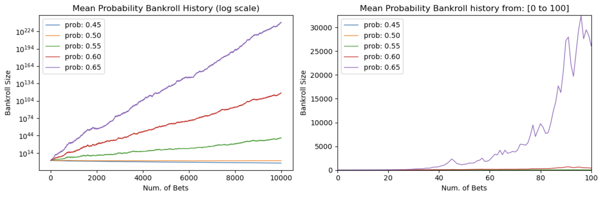
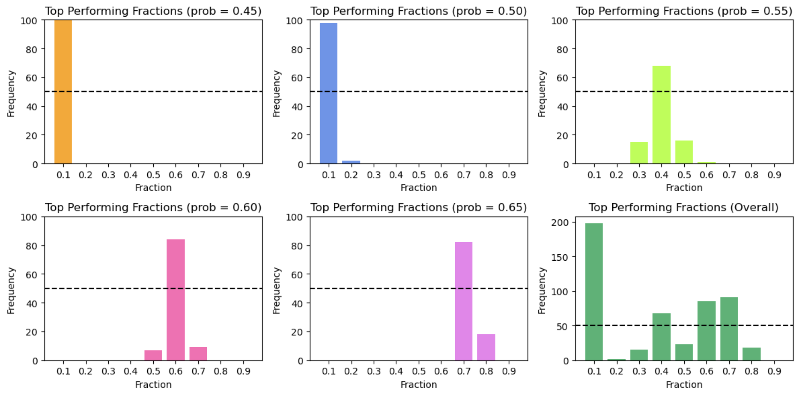
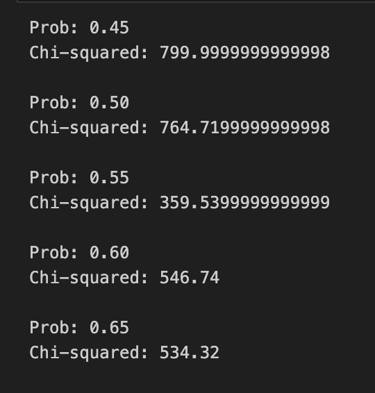

# Kelly Criterion Simulation & Analysis

## Overview
This project simulates the long-term performance of **fractional Kelly betting strategies** across varying win probabilities and betting fractions. It analyzes:
- Bankroll growth over time across multiple fractions and probabilities
- Optimal betting fractions across probabilities
- Statistical significance of results

## Motivation
The Kelly Criterion is a formula for optimizing long-term bankroll growth.
Despite being theoretically optimal, it fails to deliver substantial results in real life due to overaggressive betting and early volatility.
- Full Kelly is too aggressive and risks bankruptcy early on.
- Fractional Kelly (e.g., 1/2 or 1/5 Kelly) is more robust.

This project answers:
- Which **fraction** performs best under different conditions?
- How does **win probability** affect optimal strategy?
- Are observed trends **statistically significant**, or just noise?

## Tools & Methods
- **Python** with `numpy`, `matplotlib`
- **Modular design**: simulation, plotting, and analysis separated into `.py` files
- **Simulations**: Default 10,000+ bets per run, across multiple seeds and parameters. These can be altered easily.
- **Statistical testing**:
  - Chi-squared test for non-uniform observations of top fractions
  - Manual binomial probability calculation for significance
- **Reproducibility**: seeds to retain reproducibility, uniform sampling from seeds list to reduce sequential bias

## Key Results
### 1. **Bankroll Growth by Win Probability**
- Higher win probabilities lead to greater bankroll growth.
- Even small edges (e.g., 55%) compound dramatically over time.

### 2. **Optimal Betting Fraction**
- For `p = 0.50`, **fraction ≈ 0.1** consistently outperforms others due to risk-averse behaviour.
- Aggressive fractions (e.g., 0.8, 0.9) often lead to ruin or high variance.

### 3. **Statistical Significance**
- Chi-squared tests confirm that top-performing fractions are not due to chance.
- Probability of 50+ wins in one bin under uniformity: ~3.9e-22.

### 4. **How to Use**
- From `Simulation files` folder, run **Optimal_Kelly.ipynb** to execute a full simulation over defined probabilities and fractions.
- Different parameters can be changed at the top of the notebook, including:
	- **num_tries:** Number of bets per simulation (default: 10,000)
	- **bankroll:** Starting bankroll for each run (default: 10)
	- **fractions:** Array of betting fractions (default: 0.1 to 0.9)
	- **probabilities:** Array of win probabilities (default: 0.45 to 0.65)
	- **num_seeds:** Number of independent simulations per probability (default: 1 - 100)
	- **seed:** Global seed for reproducibility and unbiased sampling (default: 42)
